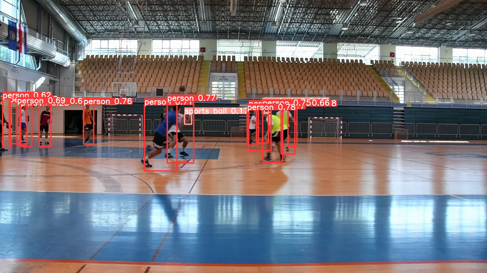
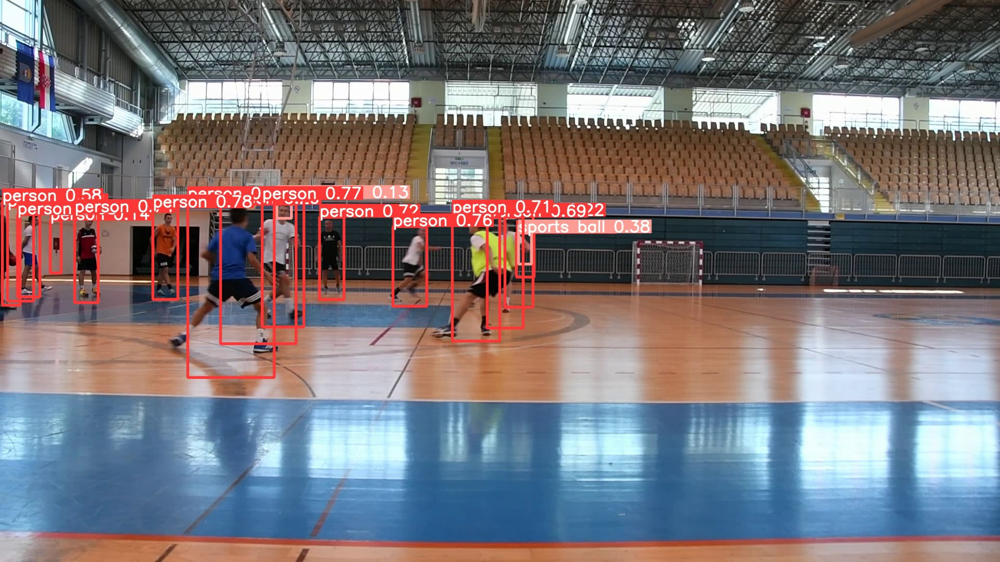
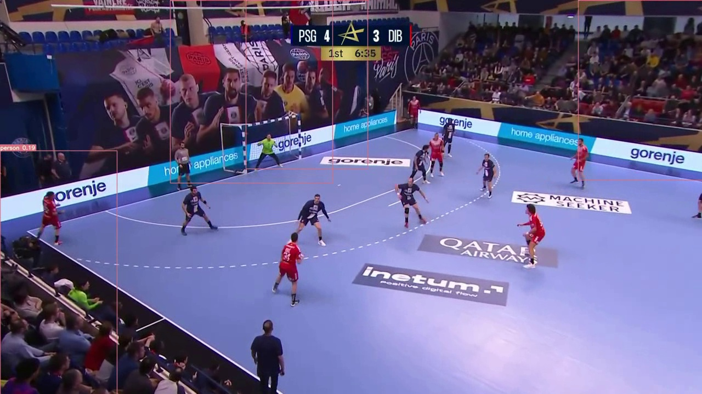

# Detekcija osoba na sportskim snimkama

## Uvod
Sportski video zapisi predstavljaju bogat izvor vizualnih podataka za analizu i razumijevanje pokreta igrača, pozicija momčadi i strategije igre. Mogućnost automatske detekcije igrača i drugih objekata u sportskim videozapisima može pružiti dragocjene uvide trenerima, sportašima i navijačima. 

Projekt obuhvaća implementaciju YOLOv5s i YOLOv7 modela na vlastitoj bazi podataka, podešavanje, analizu i usporedbu rezultata. 

## Baza
Za projekt sam kreirala bazu podataka koristeći videozapise rukometnih treninga osigurane od strane sveučilišta. 
Sastoji se od:
 - 330 slika izvučenih iz 7 videozapisa
 - 805 instanci klase osoba
 - 136 instanci klase lopta
 - 716 slika nakon predprocesiranja (zrcaljenje, rotacije, zumiranje)
 
Podjela slika na set za testiranje, učenje i validaciju


## Učenje na YOLOv5s

U prvom eksperimentu model treniram „od nule“. Model počinje s nasumično inicijaliziranim težinama i mreža postepeno uči izdvajati značajke i otkrivali objekte. Učenje se pokreće slijedećom naredbom:

```
!python train.py --img 640 --batch 16 --epochs 100 –data {dataset.location}/data.yaml --weights '' –cfg /content/yolov5/models/yolov5s.yaml -–cache
```
Model se trenira 100 epoha, s veličinom serije od 16 slika i ulaznom veličinom od 640x640 piksela. Lokacija datoteke data.yaml skupa podataka i YOLOv5s konfiguracijske datoteke navedene su pomoću argumenata --data i --cfg. Ne koriste se unaprijed pripremljene težine, i omogućeno je predmemoriranje kako bi se ubrzalo vrijeme vježbanja. Vrijeme učenja s ovim postavkama iznosi nešto više od 22 minute. 

Nakon treniranja skripta za detekciju se pokreće naredbom: 
```
!python detect.py --weights runs/train/exp/weights/best.pt --img 640 --conf 0.1 --source {dataset.location}/test/images
```
Određen je i prag pouzdanosti za detekciju objekta. U ovom slučaju  postavljen je na 0.1, što znači da će objekti s niskom ocjenom također biti prijavljeni u izlazu. Ovime bi se teoretski trebala poboljšati detekcija lopti, pošto su to mali objekti i često su prekriveni u kadru nečijom rukom i sl.

## Učenje s unaprijed određenim težinama

Nakon učenja modela „od nule“, htjela sam vidjeti ukoliko će se preciznost i ostale metrike poboljšati korištenjem unaprijed definiranih težina. Primjenom prijenosnog učenja nadala sam se boljim generalnim rezultatima. 
```
!python train.py --img 640 --batch 16 --epochs 100 --data {dataset.location}/data.yaml --weights yolov5s.pt --cache --freeze 10 --name 'feature_extraction'
```
YOLOv5s model je treniran na COCO bazi podataka za detekciju predmeta koja ima 80 klasa. Ove težine koristim na početku učenja kako bi ubrzali konvergenciju i poboljšali točnost. Također, deset početnih slojeva YOLOv5s modela će biti zamrznuto u ovom pokretanju. 


## Podešavanje modela

Iduća faza u procesu je podešavanja modela  pomoću hiperparametara i ponovno testiranje. Osnovne postavke i broj epoha su iste kao i u prethodnim koracima.

```
!python train.py --hyp 'hyp.VOC.yaml' --batch 16 --epochs 100 --data '/content/yolov5/ff-1/ff-1/data.yaml' --weights '/content/yolov5/runs/train/feature_extraction/weights/best.pt'  --name 'fine_tune' –-cache
```
Datoteka 'hyp.VOC.yaml' sadrži postavke za brzinu učenja, zamah, opadanje težine itd. Unaprijed pripremljene težine modela koje se koriste za fino podešavanje su one iz prethodnog koraka učenja s već definiranim težinama.

## YOLOv7

Koristi se ista baza, i postavke ali je format podešen za YOLOv7. Učenje se izvodi 100 epoha, veličina serije je 16, dimenzija slika 640x640. Model se uči od početka, početne težine su inicijalizirane nasumično. Naredba za pokretanje učenja je:

```
!python train.py –-batch 16 --img 640 –-epochs 100 --data {dataset.location}/data.yaml --weights '' –-cfg /content/yolov7/cfg/training/yolov7.yaml -–device 0 -–cache
```
## Rezultati
Svi modeli u radu su ocijenjeni na skupu za validaciju koristeći slijedeće mjere procjene:  preciznost (P), odziv (R) i srednju prosječnu preciznost (mAP.5) i srednju prosječnu preciznost s višim pragom (mAP.5-.95).

| Klasa         | P     | R     | mAP.5 | mAP.5-.95 |
|--------------|-------|-------|-------|-----------|
| Ukupno       | 0.754 | 0.551 | 0.593 | 0.302     |
| Osoba        | 0.894 | 0.866 | 0.926 | 0.482     |
| Sportska lopta| 0.614 | 0.235 | 0.26  | 0.122     |

Pri višim IoU pragovima, model je relativno loš u detekciji objekata. Model je bolji u otkrivanju ljudi od sportskih lopti, što može značiti da se mogu napraviti dodatna poboljšanja u obuci modela kako bi se poboljšala izvedba na klasi sportske lopte. 


Rezultati detekcije na videozapisu
<p align="center">
  
&nbsp; &nbsp; &nbsp; &nbsp;
  
</p>

## Učenje s predodređenim težinama

Gledajući rezultate čini se da model radi relativno dobro. Ukupni mAP.5 od 0.688 za sve klase zajedno ukazuje na to da model može detektirati objekte na slikama s razumnom točnošću. mAP.5 -.95 je niži, što ukazuje da bi se model mogao više boriti s identificiranjem objekata u zahtjevnijim situacijama. Mjerni podaci specifični za klasu pokazuju da je model bolji u otkrivanju ljudi nego sportskih lopti kao i u prethodnom eksperimentu bez inicijalnih težina. 

| Klasa         | P     | R     | mAP50 | mAP50-95 |
|--------------|-------|-------|-------|----------|
| Ukupno       | 0.828 | 0.619 | 0.688 | 0.353    |
| Osoba        | 0.918 | 0.886 | 0.94  | 0.524    |
| Sportska lopta| 0.737 | 0.353 | 0.436 | 0.182    |


### Rezultati nakon finetuning

| Klasa         | P     | R     | mAP.5 | mAP.5-.95 |
|--------------|-------|-------|-------|-----------|
| Ukupno       | 0.856 | 0.592 | 0.645 | 0.351     |
| Osoba        | 0.923 | 0.912 | 0.947 | 0.546     |
| Sportska lopta| 0.788 | 0.272 | 0.343 | 0.157     |

Preciznost modela je poboljšana nakon podešavanja, što znači da čini manje lažno pozitivnih detekcija. Odziv za klasu osobe se povećao a za klasu sportske lopte smanjio. Srednja prosječna preciznost se generalno smanjila, što može biti znak da dolazi do overfitting. Rezultati sugeriraju da model dobro detektira osobe. Viša preciznost znači da kada model predviđa da je objekt na slici sportska lopta, to je obično točno. Međutim, niski odziv znači da model ne identificira sve sportske lopte na slici. 

## Rezultati YOLOv7

| Klasa         | P     | R     | mAP.5 | mAP.5-.95 |
|--------------|-------|-------|-------|-----------|
| Ukupno       | 0.737 | 0.541 | 0.56  | 0.249     |
| Osoba        | 0.867 | 0.883 | 0.916 | 0.398     |
| Sportska lopta| 0.608 | 0.199 | 0.204 | 0.0999    |

Gledajući rezultate, možemo vidjeti da su  preciznost, odziv i mAP.5 za klasu osoba viši od onih za klasu sportske lopte. Model na danim slikama sposobniji detektirati ljude nego sportske lopte. mAP.5 rezultat od 0.56 ukazuje na to da model ima umjerenu razinu točnosti u otkrivanju objekata. Rezultat mAP.5 -.95 je relativno loš i govori nam kako model nije dobar u preciznom lociranju i otkrivanju objekata koji se preklapaju. 


Slika ispod prikazuje rezultat provođenja skripte za detekciju na skupu za testiranje.


Na slici ispod možemo vidjeti primjenu naučenog YOLOv7 modela na videozapis koji nije dio baze podataka i koji se dosta razlikuje od slika na kojima je model učen. Rezultati detekcije su loši, što može biti zbog različitih uvjeta na videu, premaloj bazi podataka, činjenice da je model nepodešen i da je učenje krenulo od nule, bez predefiniranih težina.



## Usporedba

| Model                    | P     | R     | mAP.5 | mAP.5-.95 |
|-------------------------|-------|-------|-------|-----------|
| YOLOv5s bez težina      | 0.754 | 0.551 | 0.593 | 0.302     |
| YOLOv5s s težinama      | 0.828 | 0.619 | 0.688 | 0.353     |
| YOLOv5s s podešavanjem  | 0.862 | 0.592 | 0.643 | 0.349     |
| YOLOv7 bez težina       | 0.737 | 0.541 | 0.56  | 0.249     |

Performanse modela najgore kod učenja s nasumično inicijaliziranim težinama. Kada koristimo već određene težine na istom skupu podataka i zamrznemo prvih 10 slojeva modela, rezultati učenja su bolji i vidi se veliki napredak u odnosu na prvi eksperiment. Nakon podešavanja modela preciznost za obje klase se povećala, ali se odziv smanjio. Srednja prosječna preciznost se također smanjila, ali je još uvijek bolja nego u prvom učenju bez definiranih težina. Općenita točnost modela je smanjena, što može značiti nekoliko stvari. Najvjerojatnije je kako podešavanje nije izvedeno korektno za ovaj specifičan model. Moguće je i da baza podataka nema dovoljno instanci svih klasa ili podataka općenito.

## Zaključak

Rezultati eksperimenata pokazuju kako je najbolji pristup za detekciju osoba i drugih objekata na video zapisima u ovom slučaju prijenosno učenje, gdje se na bazu podataka primjeni model s postojećim težinama. Važno je napomenuti da postoje i nedostaci koji su utjecali na izvedbu svih modela: mala baza podataka bez dovoljno slika, instanci klasa, varijacija okoline, svjetlosti. Za daljnja istraživanja na ovu temu, bilo bi potrebno proširiti bazu podataka i temeljito pregledati postojeću za loše označene slike. 


 	 
